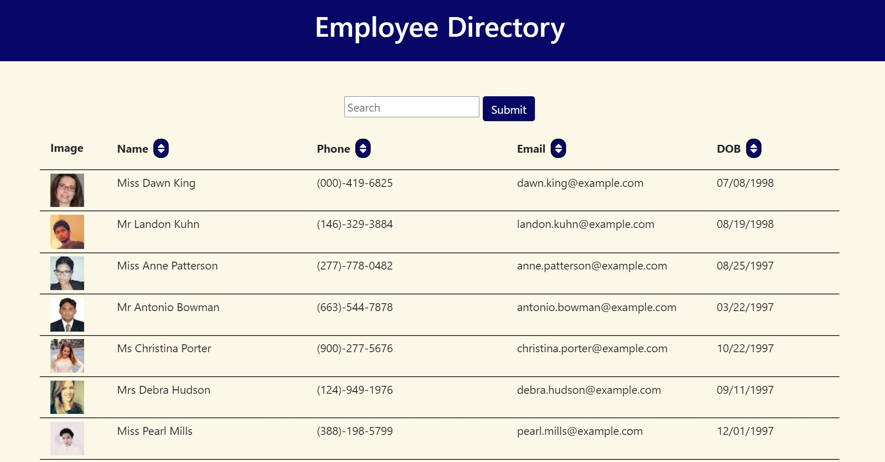

# Employee Directory

https://mykakugaya.github.io/employee-directory

## Description
This React directory application provides business managers and employees quick, simple access to non-sensitive employee information in an organized table. Users can search for an employee name in the search bar, which will dynamically filter employee results. You are also able to sort employees by category (in ascending or descending order) -- alphabetically by name or email, as well as numerically by phone number or date of birth.

## License
This project is licensed under the MIT license.

## Questions
If you have any questions about this repo, please open an issue or contact mykakugaya directly at mykakug129@gmail.com.

## Screenshot

